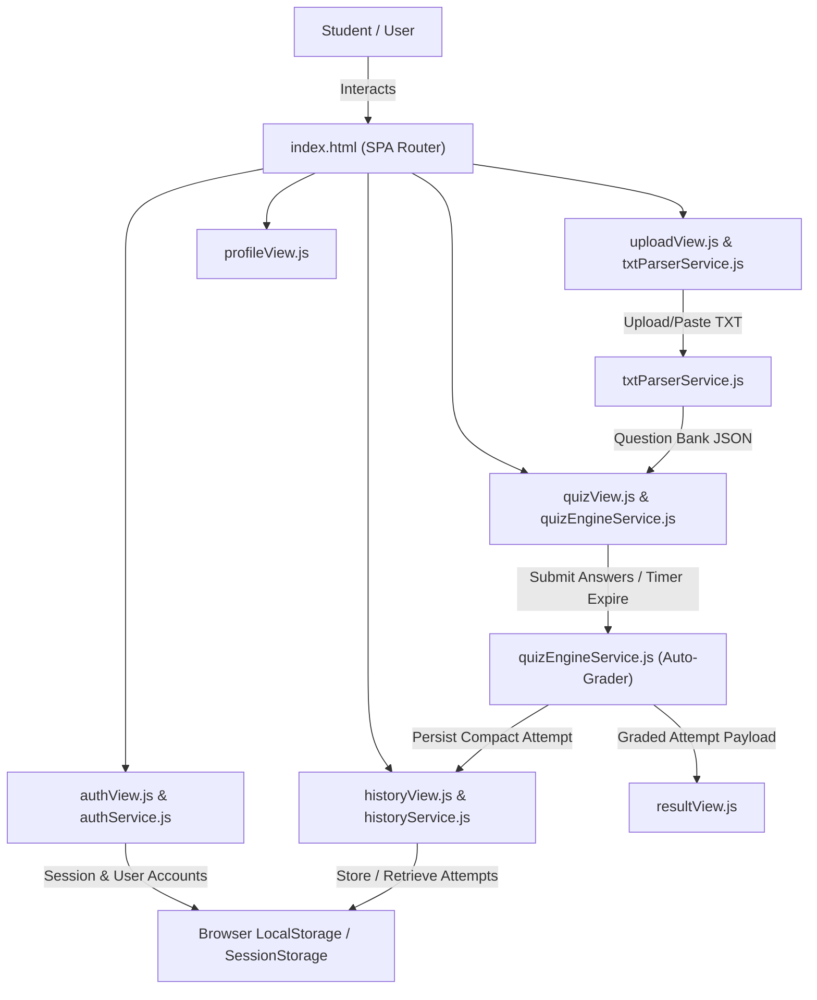

# PROJECT ARCHITECTURE & DESIGN SPECIFICATION

> **Single Source of Truth for Web Quiz System Architecture**

---

## 1. Core Tech Stack
- **Language**: JavaScript (ES6+ Modules), HTML5, CSS3
- **Styling**: Modern Vanilla CSS with CSS Custom Properties, Dark Mode Theme, Glassmorphism, Micro-animations
- **Storage & Caching**: Browser LocalStorage & SessionStorage (Zero External Database Dependency)
- **Architecture**: Modular Client-Side SPA (Single Page Application) with Service-View Separation

---

## 2. Directory Layout & Module Boundaries

```text
c:\Users\ACER\OneDrive\Documents\spec_coding\
├── 📄 index.html                        (SPA Entry Shell & Dynamic View Containers)
├── 📄 schema.sql                        (Supabase Cloud DB Tables & RLS Policies Schema)
├── 📄 vercel.json                       (Vercel SPA Routing Configuration)
├── 📂 css/
│   └── 📄 styles.css                    (Design System: Dark Theme, Glassmorphism, Animations)
├── 📂 js/
│   ├── 📄 app.js                        (Core Application Bootstrap & SPA State Router)
│   ├── 📂 services/
│   │   ├── 📄 authService.js            (User Reg/Login, Password Hashing, Session Management)
│   │   ├── 📄 telegramAuthService.js    (Telegram Bot Username Settings Configuration)
│   │   ├── 📄 supabaseClient.js         (Supabase JS Client & Cloud Database Sync Engine)
│   │   ├── 📄 txtParserService.js       (TXT File Parser, Multi-format Answer Key Detector)
│   │   ├── 📄 quizEngineService.js      (Quiz State, Countdown Timer, Automatic Grading Engine)
│   │   ├── 📄 historyService.js         (Attempt History Persistence, Search/Filter, LocalStorage Quota Guard)
│   │   ├── 📄 savedService.js           (Persistent Saved Quiz Revision Handler)
│   │   ├── 📄 feedbackService.js        (Question Error Reporting & Feedback Log Persistence)
│   │   └── 📄 aiService.js              (Google Gemini API Client with Dynamic Model Auto-Sync)
│   └── 📂 views/
│       ├── 📄 authView.js               (Auth, Regular Register, & Telegram Widget Forms Controller)
│       ├── 📄 uploadView.js             (Drag&Drop TXT Parser & AI Quiz Generator Controls Coordinator)
│       ├── 📄 quizView.js               (Interactive Quiz Timer & Question Navigation Controller)
│       ├── 📄 resultView.js             (Grading Scorecard & Education Explanation Renderer)
│       ├── 📄 historyView.js            (Quiz History Table, Answer Selection Stats & Feedback Controller)
│       ├── 📄 savedView.js              (Saved Quizzes revision viewer & Re-take dispatcher)
│       └── 📄 profileView.js            (Student Profile Editor & Aggregate Statistics View)
```

---

## 3. System Data Flow & Topology



---

## 4. Key Architectural Invariants
1. **Zero Client Security Leaks**: Correct answer indexes in active test state MUST NOT be exposed in raw DOM data attributes before test submission.
2. **Parser Error Resilience**: Malformed TXT files MUST NOT crash the UI; line errors are captured and reported cleanly.
3. **Storage Quota Protection**: LocalStorage must store compact attempt records, capping history at max 100 entries.
4. **Clean Service-View Separation**: UI views must only render DOM and delegate business logic (auth, parsing, grading, history) to `js/services/`.
