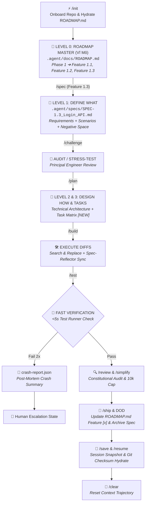

# 💨 EURUS AGENT v2.3 - MASTER STATE MACHINE WORKFLOW

## 🔄 Execution Phases

### Phase 0: Master Roadmap Hydration (`/init`)
- Scans repository architecture topology and creates `.agent/docs/ROADMAP.md`.

### Phase 1: Feature Spec Definition (`/spec`)
- Dynamic Phase Extraction generating `.agent/specs/SPEC-<id>_<name>.md`.
- Defines Business Requirements, Gherkin Scenarios, Flat YAML API Schemas, and 3 Negative Space Boundaries.

### Phase 2: Adversarial Audit (`/challenge`)
- Principal Engineer stress-test for architectural & edge-case risks before `/plan`.

### Phase 3: Technical Design & Tasks (`/plan`)
- Appends Technical Architecture Topology, Affected Files `[NEW]`, and Hierarchical Task Tree Matrix (Parent Tasks ➔ Sub-task Checkboxes `- [ ]`) with Micro-Assertions.

### Phase 4: Diff Execution & Spec-Reflector Sync (`/build`)
- Executes Level 3 sub-tasks via Search & Replace Diff blocks.
- Auto-creates empty files for `[NEW]` targets.
- Real-time `Spec-Reflector` sync updates Technical Architecture if diff alters code structure.
- Deterministic Parent Checkbox Protection: Only child sub-tasks checked by Agent.

### Phase 5: Verification & Safety Guardrails (`/test`, `/review`)
- Fast local test runner (<5s). Triggers `crash-report.json` on 2x fail.
- Multi-persona Constitutional Audit with 10,000 Output Token Cap.

### Phase 6: Launch & Milestone Auto-Update (`/ship`)
- Computes SHA256 `spec_checksum`, marks Feature as `- [x] COMPLETED` in `ROADMAP.md`, moves Spec to `specs/archive/`, and points `active_context.md` to the next Feature.
