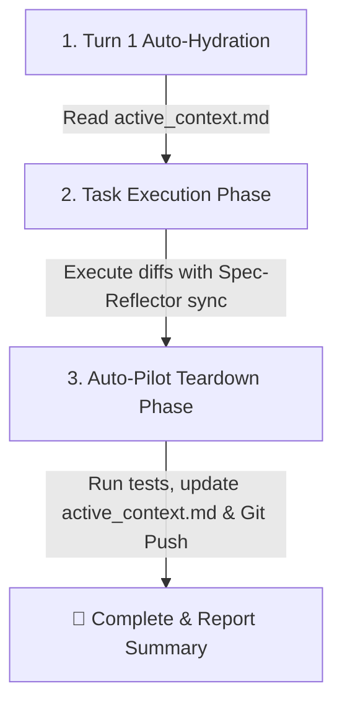

# 💨 EURUS AGENT v2.4 - AUTO-PILOT HYBRID ENGINE & CONSTITUTION

> **AUTO-HYDRATION RULE (CRITICAL)**: At turn 1 of ANY fresh conversation session, the Agent MUST automatically read [`.agent/workflows/active_context.md`](file://./.agent/workflows/active_context.md) to load current system architecture, test status, and active checkpoints in 0.5s (<100 tokens).

---

## 🧭 Dual-Trigger Router Matrix (Slash Commands & Natural Language Aliases)

| Natural Trigger / Shortcut | Slash Command | Primary Target File | Automated Action |
| :--- | :--- | :--- | :--- |
| `start`, `@init`, `đầu ngày` | `/init` | `.agent/workflows/active_context.md` | Auto-read context, check health, report status. |
| `spec`, `đặc tả` | `/spec` | `.agent/specs/SPEC-<id>_<name>.md` | Define WHAT (Scenarios, Flat YAML, 3 Negative Bounds). |
| `challenge`, `phản biện` | `/challenge` | `.agent/specs/SPEC-<id>_<name>.md` | Principal Engineer stress-test before planning. |
| `plan`, `kế hoạch` | `/plan` | `.agent/specs/SPEC-<id>_<name>.md` | Define HOW & Task Matrix (`[NEW]` file flags). |
| `build`, `gõ code` | `/build` | `.agent/specs/SPEC-<id>_<name>.md` | Execute diffs + Spec-Reflector 2-way sync. |
| `test`, `kiểm thử` | `/test` | `.agent/skills/test/SKILL.md` | Run fast isolated tests (<5s). |
| `continue`, `@resume`, `tiếp tục`| `/resume` | `.agent/workflows/active_context.md` | Read last checkpoint and resume work in 0.5s. |
| `save`, `end`, `cuối ngày`, `xong`| `/ship` / `/save` | `.agent/workflows/active_context.md` | Auto-test ➔ Auto-update context ➔ Auto-git commit/push. |
| `fork`, `phát triển mới` | `/spec` | `.agent/specs/archive/` | Archive old specs & open new Phase in ROADMAP.md. |

---

## 🚀 Lifecycle Execution Protocol

## ⚡ Core Rules
1. **Zero Token Waste**: Always read `.agent/workflows/active_context.md` first to avoid re-scanning the entire codebase.
2. **Auto-Pilot on Teardown**: When completing a task or receiving `save`/`xong rồi`, automatically run test runner, update context & history, git commit & push, and output summary.
3. **Negative Space Protection**: Enforce 3 explicit negative bounds during `/build`.
